<div align="center">
  

  # clipper

  Vidéo YouTube ou VOD Twitch → clips verticaux TikTok sous-titrés, prêts à publier.

  <p>
    
    
    
    
  </p>
</div>

> ⚠️ **Pré-version.** Pas encore de garantie de stabilité de la ligne de
> commande ni du format de configuration. Voir
> [`docs/releases/v0.1.0.md`](docs/releases/v0.1.0.md).

## Ce que ça fait

`clipper` transforme une vidéo longue (live, podcast, reportage, VOD
Twitch...) en clips verticaux (9:16) sous-titrés, prêts à publier sur
TikTok. Une vidéo de plusieurs heures est découpée en moments forts —
sélectionnés par un LLM noté selon une grille et un jury à cinq juges — puis
chaque moment devient un clip (ou plusieurs parties s'il est trop long),
sous-titré mot par mot et recadré verticalement.

Le pipeline tourne en local : téléchargement, transcription
(faster-whisper), détection de scènes/visages, rendu (ffmpeg) sur ta
machine ; seules les étapes qui demandent du jugement (choix des moments,
points de coupe, titres/légendes, contrôle qualité...) passent par Claude
via `clipper.llm`.

## Démo

Rejeu d'une vraie session (identifiants remplacés par un id neutre) :



Les 12 étapes, du téléchargement au clip prêt :


<!-- demo-clip.gif -->

## Points forts

- **Mode `auto` de bout en bout** — sélection des moments, découpage,
  sous-titrage, recadrage, rendu et contrôle qualité sans intervention, avec
  reprise en file d'attente sur échec transitoire plutôt qu'un résultat
  dégradé en silence.
- **Jury IA à cinq juges** (rétention, monteur, avocat, spectateur,
  conformité) pour la sélection automatique des moments, appris de ses
  erreurs sans uniformiser les avis.
- **Deux formats de recadrage** — `letterbox` (zoom fixe, défaut) et
  `stream` (facecam fixe agrandie + jeu, pour les VOD de streamers).
- **Appel à l'abonnement optionnel** — pseudo de chaîne discret et carte de
  fin « Abonne-toi ! », désactivé par défaut, activable par preset de chaîne.
- **Tout tourne sur CPU** si besoin (`clipper.gpu` détecte CUDA
  automatiquement, jamais codé en dur), un seul modèle lourd en VRAM à la
  fois.
- **Étapes indépendantes et reprises depuis le cache** — une étape déjà
  faite ne se relance pas sauf `--force`.

## Installation

```powershell
uv venv
uv pip install -e ".[test]"
```

`uv` est **obligatoire** (pas `pip` seul) : `pyproject.toml` déclare sous
`[tool.uv] override-dependencies` un contournement qui force un seul paquet
OpenCV installé (`opencv-contrib-python`) — `mediapipe` et `scenedetect` en
réclament chacun un différent, et `pip` seul ignore ce réglage.

Ou lance `tools/setup.ps1`, qui fait tout ça et vérifie les prérequis (uv,
Python 3.11, ffmpeg, `claude`, `ank`, GPU optionnel).

Depuis la release (sans cloner le dépôt) : télécharge le `.whl` de la
[dernière release](docs/releases/v0.1.0.md) puis `uv pip install
clipper-0.1.0-py3-none-any.whl`.

**Prérequis** : Python 3.11 (géré par uv), [ffmpeg](https://ffmpeg.org/)
(et `ffprobe`) dans le PATH, [Claude Code CLI](https://docs.claude.com/claude-code)
(`claude`) connecté (backend LLM par défaut). Pilote NVIDIA optionnel pour
accélérer transcription et rendu ; sans GPU, tout tourne sur CPU.

## Démarrage rapide

```powershell
cp config.example.toml config.toml   # mode "review" par defaut
python -m clipper -v run <url-youtube-ou-twitch>
python -m clipper serve              # interface web locale : http://127.0.0.1:8000
```

En mode `review`, l'interface web (ou `python -m clipper decide`) sert à
accepter/refuser/ajuster chaque moment proposé, puis `python -m clipper
render <video_id>` (ou le bouton « rendre » de l'interface) termine le clip.
Voir [`docs/GUIDE.md`](docs/GUIDE.md) pour le détail des commandes.

## Formats

- **letterbox** (défaut, `[reframe] format = "letterbox"`) — aucune
  détection de visage : image source zoomée et centrée, fond flou de la
  même vidéo, titre d'écran dans la bande floue du haut, sous-titres dans
  celle du bas.
- **stream** (`layout = "stream_auto"`) — pour les vidéos avec facecam :
  facecam fixe agrandie en haut, jeu en bas, jamais de bascule de mise en
  page au sein d'un même clip.

Contrat de sortie complet (zones sûres TikTok, style des sous-titres...) :
`SPEC-6a47` et `SPEC-3a88` dans `AGENTS.md`.

## Preset par chaîne et CTA abonnement

Un fichier de config par chaîne active des réglages spécifiques sans
toucher `config.toml` :

```powershell
python -m clipper run <url> --config presets/ma-chaine.toml
```

L'appel à l'abonnement est **désactivé par défaut** ; sans configuration
explicite, le rendu, le sidecar et la légende restent identiques. Pour
l'activer dans un preset :

```toml
[render]
cta_enabled = true
cta_handle = "twitch.tv/ma-chaine"   # obligatoire si cta_enabled
cta_seconds = 2                       # duree de la carte de fin (s)
```

`cta_enabled` sans `cta_handle` est une erreur explicite, jamais un rendu à
moitié activé.

## Modes review/auto

- **review** (défaut) — rien n'est publié sans validation humaine des
  moments proposés (accepter / refuser / ajuster les bornes), via
  l'interface web ou `python -m clipper decide`.
- **auto** — le pipeline va jusqu'au bout tout seul ; le contrôle qualité
  (étape `qa`) remplace la revue humaine, et un échec transitoire (Claude
  indisponible, quota, réseau) remet la vidéo en file d'attente au lieu
  d'abandonner ou de produire un résultat dégradé en silence.

## Interface web

`python -m clipper serve` lance un serveur FastAPI local
(`http://127.0.0.1:8000`) : coller une URL, suivre la progression étape par
étape, revoir les moments proposés, lancer le rendu, voir les clips. La page
est statique (HTML/CSS/JS, sans étape de build) et n'appelle que
`clipper.pipeline` — aucune logique de traitement vidéo, audio ou LLM côté
web.

## Coûts et performances

Mesures détaillées (VRAM, durée par étape, coût LLM, choix du modèle
whisper) sur RTX 3050 4 Go : [`docs/benchmarks/rtx3050.md`](docs/benchmarks/rtx3050.md).
Banc dédié whisper `small` vs `large-v3-turbo` :
[`docs/bench-whisper-vitesse.md`](docs/bench-whisper-vitesse.md).

## Configuration

Chaque étape du pipeline (module `clipper/x.py`) déclare son propre dict
`CONFIG_DEFAULTS` : c'est lui qui rend une table `[x]` de `config.toml`
valide (clé absente refusée, section sans module ou sans `CONFIG_DEFAULTS`
refusée). Copie `config.example.toml` vers `config.toml` et ajuste au
besoin ; les réglages retenus après le banc RTX 3050 y sont documentés en
commentaire.

## Documentation

- [`docs/GUIDE.md`](docs/GUIDE.md) — guide utilisateur : les 12 étapes du
  pipeline, modes, formats, configuration complète, consommation du quota
  Claude, dépannage.
- [`AGENTS.md`](AGENTS.md) — conventions du dépôt et décisions ratifiées
  (ADR/SPEC), pour qui contribue au code.
- [`CHANGELOG.md`](CHANGELOG.md) — historique des versions.
- [`docs/releases/v0.1.0.md`](docs/releases/v0.1.0.md) — notes de la
  pré-version 0.1.0.

## Développement

```powershell
pytest
```

Tout le pipeline doit tourner sur CPU pour les tests (ADR-fb9b) : aucun test
n'a besoin d'un GPU pour passer. Ce qui a réellement besoin du réseau, d'un
vrai modèle ou du vrai Claude est un test optionnel, sauté par défaut
(`skipif`), jamais lancé en CI ni par défaut en local.

Les tâches et décisions du dépôt vivent dans `.ank/`, gérées par la CLI
[`ank`](https://github.com/haksolot/ank) (`ank context`, `ank claim`, `ank
show`, `ank done`...) — voir `AGENTS.md` pour les règles complètes.

## Limites et feuille de route

- Le format `crop` (suivi de visage) reste une option figée, moins
  travaillée que `letterbox`.
- Sans GPU, le pipeline tourne mais plus lentement (transcription et rendu
  en CPU).
- Le mode `auto` dépend de la disponibilité de Claude ; une panne prolongée
  met les vidéos en file d'attente plutôt que de les abandonner.
- Aucun contenu ni capture vidéo tiers n'est utilisé dans ce dépôt ou sa
  documentation ; un futur GIF de démonstration viendra d'une vidéo sous
  licence libre (voir l'emplacement commenté ci-dessus).
