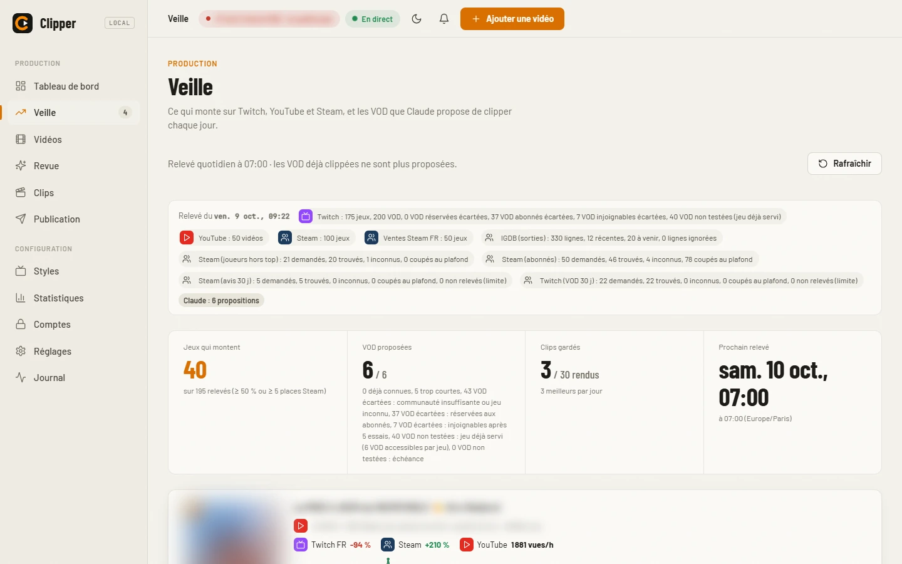
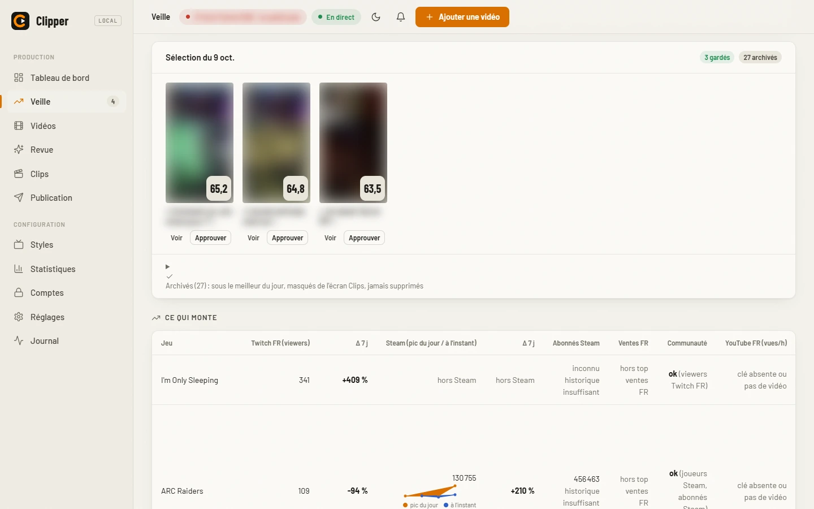
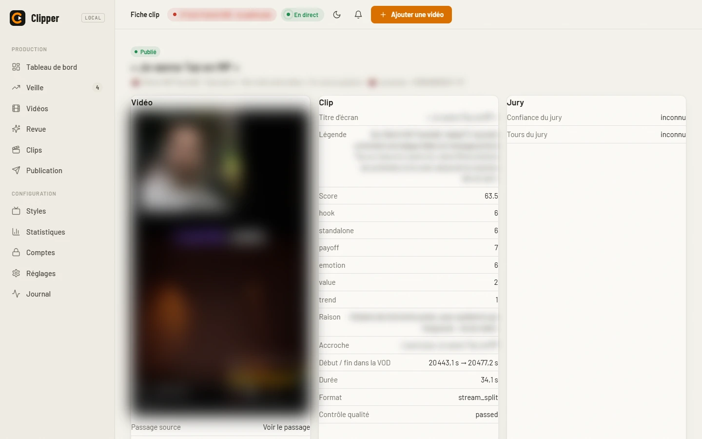
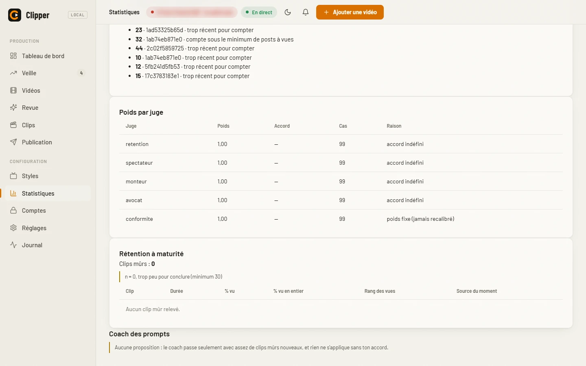

<div align="center">
  

  # clipper

  **Une vidéo longue en entrée, des clips verticaux sous-titrés en sortie, publiés sur TikTok et YouTube Shorts depuis une console web locale.**

  <p>
    
    
    
    
  </p>

  
</div>

> ⚠️ **Pré-version.** Pas encore de garantie de stabilité de la ligne de
> commande ni du format de configuration. Voir
> [`CHANGELOG.md`](CHANGELOG.md) (section `[0.6.0]`) et le plan de versions
> [`docs/versions.md`](docs/versions.md).

## Ce que ça fait

`clipper` fait le trajet complet **vidéo longue → clips 9:16 → publication** :

1. **Entrée** : une URL YouTube ou une VOD Twitch (live, podcast, reportage,
   stream de jeu...), seule, surveillée par style, ou proposée par la
   [veille](#veille-des-sujets-chauds).
2. **Sélection** : transcription, scènes, (pour les jeux) passages d'action,
   puis moments forts choisis par un LLM, notés selon une grille et par un
   jury de juges IA ; en mode `review`, tu acceptes, refuses ou ajustes chaque
   moment.
3. **Rendu** : chaque moment devient un clip vertical (ou plusieurs parties
   s'il est trop long), sous-titré mot par mot, recadré, avec un titre
   d'écran, puis contrôlé par une étape qualité.
4. **Publication et suivi** : la console valide les clips, les place sur des
   créneaux et les publie sur TikTok ou YouTube Shorts par un vrai Chrome,
   relève les statistiques, et le jury en tire des leçons.

Tout tourne en local (téléchargement, transcription faster-whisper, scènes,
rendu ffmpeg) ; seules les étapes de jugement (moments, points de coupe,
titres et légendes, contrôle qualité...) passent par Claude via
`clipper.llm`.

## Démo

| Progression en direct | Radar du jury | Nouvelle publication |
|---|---|---|
|  |  |  |
| Frise des étapes et journal en direct. | Les juges, moment par moment. | Un clip, un compte, maintenant ou à une date. |

Générées sur des données de démonstration (voir [Développement](#développement)).
Rejeu d'une vraie session en ligne de commande (identifiants remplacés par un
id neutre), puis le schéma du pipeline :


## Points forts

- **Mode `auto` de bout en bout**, avec reprise en file d'attente sur échec
  transitoire plutôt qu'un résultat dégradé en silence.
- **Jury de juges IA** (rétention, spectateur, monteur, avocat, conformité,
  anonymes, débat sur les divergences, veto conformité) qui apprend de ses
  erreurs sur les vraies statistiques, sans uniformiser les avis.
- **Styles gaming** : grilles `builtin:gaming` et `builtin:gaming-action`,
  candidats d'action tirés du jeu lui-même, format stream avec webcam trouvée
  par période.
- **Veille** des sujets chauds (Twitch, YouTube, Steam, IGDB), désactivée par
  défaut.
- **Console web** de onze écrans, progression en temps réel.
- **Publication TikTok et YouTube Shorts** multi-comptes par un vrai Chrome,
  mots de passe dans le coffre de l'OS (risques assumés).
- **Installeur portable Windows** : un zip, un double-clic.
- **CPU possible** (`clipper.gpu` détecte CUDA, jamais codé en dur), un seul
  modèle lourd en VRAM à la fois ; une étape déjà faite ne se relance pas
  sauf `--force`.

## Installation sans outils de développement

Pas envie de cloner le dépôt, d'installer Python ou `uv` ? Télécharge le zip
portable de la
[Release GitHub](https://github.com/ZeDKouill3/TiktokClipper/releases)
(`Clipper-portable-0.6.0.zip`), dézippe-le et double-clique sur
`Installer.bat` : il installe Python, ffmpeg, `claude` et les modèles dans son
propre dossier (programme sous `%LOCALAPPDATA%\Clipper`, données sous
`Documents\Clipper`), CUDA seulement si un GPU NVIDIA est détecté, puis
vérifie le tout avec `clipper doctor`. Une mise à jour = relancer
`Installer.bat` depuis le nouveau zip, tes données ne sont pas touchées.
Parcours complet (prérequis, connexion à Claude, premier clip, mise à jour,
désinstallation, dépannage) : [`docs/INSTALLATION.md`](docs/INSTALLATION.md).

## Installation développeur

```powershell
uv venv
uv pip install -e ".[test]"
```

`uv` est **obligatoire** (pas `pip` seul) : `pyproject.toml` déclare sous
`[tool.uv] override-dependencies` un contournement qui force un seul paquet
OpenCV installé — `mediapipe` et `scenedetect` en réclament chacun un
différent, et `pip` seul ignore ce réglage.

Ou lance `tools/setup.ps1`, qui fait tout ça et vérifie les prérequis (uv,
Python 3.11, ffmpeg, `claude`, `ank`, GPU optionnel, Google Chrome pour
[publier](#publier-sur-tiktok)).

Depuis la release (sans cloner le dépôt) : télécharge le `.whl`, `uv pip
install clipper-0.6.0-py3-none-any.whl` puis `clipper init` (écrit
`config.toml` et `rubric.toml` dans le dossier courant). La commande
`clipper` s'ajoute à `python -m clipper`.

**Prérequis** : Python 3.11 (géré par uv), [ffmpeg](https://ffmpeg.org/) (et
`ffprobe`) dans le PATH, [Claude Code CLI](https://docs.claude.com/claude-code)
(`claude`) connecté (backend LLM par défaut). Pilote NVIDIA optionnel.

## Démarrage rapide

```powershell
cp config.example.toml config.toml   # mode "review" par defaut
python -m clipper -v run <url-youtube-ou-twitch>
python -m clipper serve              # console web : http://127.0.0.1:8000
```

**Lanceur Windows.** `Clipper.bat`, à la racine du dépôt, démarre
`clipper serve` s'il ne tourne pas déjà puis ouvre `http://127.0.0.1:8000`
(double-clic). `tools/creer-raccourci.ps1` crée un raccourci `Clipper.lnk`
avec le logo :

```powershell
powershell -ExecutionPolicy Bypass -File tools/creer-raccourci.ps1
```

En mode `review`, la console (ou `python -m clipper decide`) sert à
accepter, refuser ou ajuster chaque moment, puis `python -m clipper render
<video_id>` (ou le bouton « rendre ») termine le clip. Toutes les commandes :
[`docs/GUIDE.md`](docs/GUIDE.md).

## Formats

Le pipeline compte 13 étapes : `download`, `transcribe`, `audio`, `scenes`,
`action`, `moments`, `vision`, `parts`, `captions`, `reframe`, `subtitles`,
`render`, `qa`. `action` ne produit qu'un résultat vide sans `[action] enabled
= true` ; la frise de la console les montre toutes.

- **letterbox** (défaut, `[reframe] format = "letterbox"`) : image source
  zoomée et centrée, fond flou de la même vidéo, titre d'écran dans la bande
  du haut, sous-titres dans celle du bas.
- **stream** (`layout = "stream_auto"`) : pour les vidéos avec webcam. La
  webcam est repérée par période du stream (rectangles candidats numérotés
  choisis par Claude, garde-fous locaux journalisés) ; un clip en stream
  exige un visage dans la webcam, et sans webcam réelle le clip repasse en
  letterbox. Deux variantes : `stream_variant = "top"` (webcam fixe agrandie
  en haut, jeu en bas) ou `"split"` (webcam en haut, jeu en bas, badge
  optionnel, sous-titres réglables).
- `crop` (suivi de visage) reste une option figée, moins travaillée.

Titre d'écran sobre (sans emoji ni superlatif par défaut), `.mp4` + `.json`
sidecar, appel à l'abonnement désactivé par défaut : contrat de sortie dans
`AGENTS.md` (SPEC-6a86, SPEC-5b9a).

## Styles, grille gaming et CTA abonnement

Un fichier de config par style (`presets/<nom>.toml`) active des réglages
spécifiques sans toucher `config.toml` ; il se crée aussi dans l'écran
**Styles** de la console. Un style n'a ni compte de publication ni créneaux :
le compte se choisit à chaque publication, les créneaux se règlent sur le
compte (écran **Comptes**). Exemple avec le style neutre `ma_chaine` :

```toml
[channel]
display_name = "ma_chaine"
source_url = "https://www.twitch.tv/ma_chaine/videos"
watch = true                      # nouvelles VOD : en file (auto) ou « à confirmer » (review)

[reframe]
layout = "stream_auto"            # webcam détectée : agencement stream
stream_variant = "split"          # webcam en haut, jeu en bas

[moments]
rubric_path = "builtin:gaming"    # grille gaming embarquée
```

```powershell
python -m clipper run <url> --config presets/ma_chaine.toml
```

**Grilles.** `builtin` (défaut) est la grille standard ; `builtin:gaming` pèse
plus l'émotion du streamer, retient des clips plus courts et abaisse le seuil ;
`builtin:gaming-action` juge ce qui se passe *dans le jeu* (critère `action`
de poids 5, seuil de retenue 50, clips de 20 à 90 s). Un chemin de fichier
choisit une grille personnalisée. La table optionnelle `[gate]` d'une grille
fixe un **seuil éliminatoire** (`criterion`, `min`, et `unless_criterion` avec
`unless_min` : une réaction forte sauve un monologue) ; sans `[gate]`, rien
ne change.

**Candidats d'action (étape `action`).** Pour un style gaming, les moments ne
viennent pas que de la transcription : avec `[action] enabled = true`,
l'étape `action` (entre `scenes` et `moments`) cherche sans LLM les passages
de jeu (pics audio hors parole, densité de changements de plan), fait
décrire leurs images par le LLM (`action.json`), et `[moments] candidates =
"transcript+action"` les ajoute aux candidats de la transcription, notés par
le même jury et la même grille. Le coût est borné par heure de VOD ; les
réglages sont dans `CONFIG_DEFAULTS` de `clipper/action.py`.

```toml
# Twitch gaming : format stream
[reframe]
layout = "stream_auto"
stream_variant = "split"

[moments]
rubric_path = "builtin:gaming-action"
candidates = "transcript+action"

[action]
enabled = true
```

```toml
# Letterbox gaming : aucune table [reframe]
[moments]
rubric_path = "builtin:gaming-action"
candidates = "transcript+action"

[action]
enabled = true
```

**Appel à l'abonnement.** **Désactivé par défaut** ; sans configuration
explicite, rendu, sidecar et légende restent identiques. Dans un preset :

```toml
[render]
cta_enabled = true
cta_handle = "twitch.tv/ma_chaine"   # obligatoire si cta_enabled
cta_seconds = 2                       # duree de la carte de fin (s)
```

`cta_enabled` sans `cta_handle` est une erreur explicite, jamais un rendu à
moitié activé.

## Modes review/auto

- **review** (défaut) : rien n'est publié sans validation humaine des moments
  (accepter / refuser / ajuster les bornes), dans la console ou par
  `python -m clipper decide`.
- **auto** : le pipeline va jusqu'au bout seul ; le contrôle qualité (`qa`)
  remplace la revue, et un échec transitoire (Claude indisponible, quota,
  réseau) remet la vidéo en file au lieu d'abandonner ou de dégrader en
  silence. Aucune valeur de secours silencieuse : un échec remonte, est
  journalisé, ou met la vidéo en attente.

Le **jury** (`[jury]`) remplace un juge unique : au moins trois juges
indépendants et anonymes notent chaque moment avec leur confiance, un débat
ciblé porte sur les divergences, et le juge conformité peut opposer un veto
motivé.

## La console en images

Captures en thème clair de la vraie console (`python -m clipper serve`), prises
en lecture seule. Le dépôt est public : les vignettes, jaquettes, miniatures,
titres de VOD et noms de chaînes tiers sont floutés, et l'écran Comptes
(adresses e-mail) n'est pas montré. Les animations plus bas viennent de
données de démonstration neutres.

### Tableau de bord


Ce qui tourne, ce qui attend, ce qui demande ta décision : vidéos en cours,
file, échecs à relancer, clips à valider, prochaines publications, état du
worker, coût LLM et alerte « posts à 0 vue » (voir
[Apprentissage](#apprentissage-du-jury)).

### Veille





Le relevé du jour (une pastille par source, avec ses comptes d'éléments
demandés, trouvés et écartés), les VOD que Claude propose de clipper (envoi
ou « Ignorer » en un clic), la sélection des meilleurs clips du jour et le
tableau des jeux qui montent. Détail dans
[Veille des sujets chauds](#veille-des-sujets-chauds).

### Vidéos : liste et fiche


La liste se filtre par style, statut et texte ; une vidéo s'ajoute par URL. La
fiche montre la frise des étapes, la progression et le temps restant de
l'étape en cours, et le journal (`events.jsonl`) en direct ; chaque étape se
relance depuis là.

### Radar du jury


Pour chaque moment retenu ou écarté, un radar superpose la note de chaque juge
sur les critères de la grille ; un trait pâle signale un juge peu sûr de lui,
et « Avant débat / Après débat » montre l'effet de la discussion.

### Clips


La galerie 9:16 regroupe les clips par statut ; le tiroir d'un clip permet
d'éditer description, hashtags et titre d'écran, d'approuver, de refuser ou
de relancer le rendu, et ouvre la **fiche complète** du clip : score et
critères, passage dans la VOD, QA, jury, publication (compte, statut,
créneau, lien du post) et relevés TikTok du post. Une donnée absente s'affiche
« inconnu », jamais 0. Un clip publié dont la vidéo a été supprimée garde sa
fiche et ses statistiques.



### Publication


À gauche, « Nouvelle publication » et les publications en cours ; à droite,
le calendrier de la semaine avec les créneaux du compte. Un clip se publie
maintenant ou à une date, sans créneau obligatoire.

### Statistiques


Les chiffres relevés sur TikTok Studio, compte par compte (détail dans
[Statistiques TikTok](#statistiques-tiktok)), et la fiche d'une vidéo.



Le bloc « Rétention à maturité » liste la part vue de chaque clip mûr, sans
corrélation calculée : sous le minimum de clips (`[learning] retention_min_n`),
il le dit au lieu de conclure (voir [Apprentissage du jury](#apprentissage-du-jury)).

### Comptes

Le carnet des comptes : mot de passe dans le coffre de l'OS (affiché à la
demande seulement), état de connexion lu dans les cookies du profil, case
« prêt à publier » mise à jour toute seule, et pause manuelle d'un compte d'un
clic.

## Interface web : Console de gestion web (v2)

`python -m clipper serve` lance la console (`http://127.0.0.1:8000`) et le
worker, qui traite la file de vidéos une à la fois. Onze écrans : Tableau de
bord, Veille, Vidéos, Revue des moments, Clips, Publication, Styles
(presets en surcouche, éditeur d'agencement, aperçu des sous-titres),
Statistiques, Comptes, Réglages et Journal ; progression en temps réel,
surveillance des VOD d'un style, notifications du navigateur. Pendant qu'une
vidéo se traite, le worker précharge le téléchargement de la suivante
(`[worker] prefetch_download`). La page est statique (HTML/CSS/JS, sans étape
de build) et ne fait aucun traitement vidéo, audio ou LLM.

Pour l'ouvrir depuis un téléphone du réseau local :
`python -m clipper serve --host 0.0.0.0`, ce qui exige `[web] token` dans
`config.toml`. Pas de TLS : ne pas exposer le port sur Internet sans reverse
proxy TLS. Détails dans [`docs/GUIDE.md`](docs/GUIDE.md).

## Veille des sujets chauds

La veille (`[veille] enabled = true`, désactivée par défaut) relève chaque jour
à `run_at` (07:00, heure de Paris) ce qui monte, **sources officielles
seulement** : Twitch (Helix), YouTube, Steam (joueurs simultanés, avis,
abonnés) et IGDB (dates de sortie et hype, avec le jeton d'app Twitch). Chaque
jeu retenu a un historique de tendance sur 30 jours, jamais estimé (un jour
sans relevé reste vide). Claude choisit parmi les VOD accessibles celles à
proposer ; tu les envoies à Clipper ou les ignores dans l'écran **Veille**, qui
montre aussi le calendrier des sorties et les meilleurs clips du jour
(archivés, jamais supprimés). Le relevé tourne dans le worker, dans un fil qui
ne bloque jamais la file ; l'état vit sous `state/veille/`.

## Publier sur TikTok

La publication passe par un **vrai Chrome visible** piloté par Playwright, avec
un profil par compte rangé dans `state/browser/<compte>/` (ignoré par git,
jamais copié hors de `state/`). Le programme ne saisit **jamais** ton
identifiant ni ton mot de passe : tu te connectes à la main, une fois, dans un
**Chrome normal**.

1. **Ajouter un compte** : écran **Comptes** (libellé, plateforme) ; ses
   **créneaux** réguliers (jour + heure, fuseau du compte) se règlent dans le
   même formulaire. Aucun compte n'est rattaché à un style : chaque
   publication (écran **Publication**) choisit son compte, et une
   publication sans compte échoue avec un message explicite.
2. **Se connecter une fois** : bouton **Se connecter dans le navigateur** du
   compte (console ouverte sur `127.0.0.1` seulement), ou `python -m clipper
   browser login <compte>` (`--url` pour une autre page). Un **Chrome normal**
   (lancé comme un programme ordinaire, jamais par Playwright) s'ouvre sur la
   page de connexion : connecte-toi, puis ferme la fenêtre. TikTok refuse un
   Chrome piloté (faux message « Nombre maximal de tentatives atteint ») ;
   ensuite Playwright réutilise la session du profil pour publier.
3. **Prérequis** : Google Chrome (trouvé dans le `PATH` ou aux emplacements
   usuels ; sinon `[browser] chrome_path = "C:\\...\\chrome.exe"`) et
   `playwright`, installé par `tools/setup.ps1`. Sans Chrome, la connexion
   échoue avec un message explicite ; sans Playwright, la publication échoue
   avec la commande à lancer (`playwright install chrome`) : aucun navigateur
   de remplacement.

**Risques assumés** : piloter TikTok par un navigateur n'est pas prévu par ses
conditions d'utilisation ; le compte peut subir un captcha, une vérification
ou une restriction. **Captcha, vérification ou page inattendue = arrêt
immédiat** : le programme ne résout ni ne contourne jamais un captcha, il
laisse la main à l'utilisateur et remonte l'échec.

**YouTube Shorts.** Même principe sur YouTube Studio : comptes YouTube,
publication immédiate ou programmée, `#Shorts` ajouté si absent, statistiques
relevées à l'usage.

### Publication automatique (worker)

Le worker (`python -m clipper worker`, lancé par `serve`) publie, une à la
fois et un compte à la fois, les clips **dus** (`state/publish/<style>.json`,
statut `scheduled`) avec le mp4, la légende et les hashtags du sidecar. Deux
modes, par `[tiktok] publish_mode` (ou par clip) :

- `immediate` (défaut) : publié quand le créneau est atteint (le PC doit être
  allumé) ;
- `scheduled` : programmé côté TikTok à la date du créneau, à moins de
  `schedule_max_days` jours (10, la limite de TikTok Studio) ; au-delà, ou à
  moins de `schedule_min_minutes` du créneau, la programmation est refusée
  explicitement.

Le succès enregistre l'URL ou l'id du post. **Tout arrêt** (captcha,
vérification, connexion expirée, élément absent, page inattendue) met le clip
en `failed` avec la raison et une capture sous
`state/browser/<compte>/captures/`, arrête les publications de ce compte et
notifie la console (bouton **Réessayer**). Avant le clic final, le programme
attend la **vérification de contenu** de TikTok (`content_check_timeout_s`,
900 s) : problème signalé ou délai dépassé = arrêt, rien n'est publié. Les
fenêtres connues sont fermées et journalisées, toute autre fenêtre modale est
un arrêt. Un post supprimé à la main de la plateforme se marque « Supprimé de
la plateforme » (rien n'est effacé côté plateforme, le clip n'est jamais
republié). Les sélecteurs de TikTok Studio vivent dans
`clipper/assets/tiktok_selectors.toml`.

Rythme (`[tiktok]`, étude [`docs/tiktok-cadence.md`](docs/tiktok-cadence.md)) :
délais aléatoires entre actions, plafond de posts par jour, écart minimal par
compte ; un dépassement reporte le clip au prochain créneau libre. Les défauts
sont ceux d'un **compte neuf** :

| Réglage | Compte neuf (défaut) | Compte établi (après 14 jours) |
|---|---|---|
| `max_posts_per_day` | 1 | 3 |
| `min_gap_minutes` | 480 | 240 |

## Statistiques TikTok

L'écran **Statistiques** affiche ce que TikTok Studio montre pour chaque compte
relié : tuiles (vues, vues du profil, j'aime, commentaires, partages) sur 7,
28 et 60 jours, courbes par jour, et toutes les vidéos du compte, y compris
celles publiées hors de Clipper. Le relevé ouvre le Chrome du profil (lecture
seule) :

- il n'a lieu que quand tu te sers de Clipper : à l'ouverture de l'écran si le
  dernier a plus de `[tiktok] stats_stale_min` minutes (60), pendant une
  publication, et par **« Relever maintenant »** ; un seul à la fois par
  compte (`[tiktok] stats_interval_h = 0` coupe le relevé périodique) ;
- chaque relevé s'ajoute à l'historique `state/stats/tiktok/<compte>/` sans
  écraser le précédent, un jour sans relevé reste vide ;
- la **fiche d'une vidéo** donne vues, temps de visionnage, courbe de
  rétention, spectateurs et engagement (TikTok ne les remplit qu'à partir de
  100 vues), et renvoie au clip Clipper d'origine ;
- un captcha ou une page inattendue **arrête** le relevé, raison affichée.

### Apprentissage du jury

Sous les statistiques, la section **Apprentissage** relie chaque post relevé à
son clip et à ses juges. La vérité terrain, ce sont les signaux réels (vues
rapportées aux autres posts du compte). Une vue n'entre dans la mesure qu'**à
maturité** (`maturity_days`, 3 jours). Le poids des juges est recalibré
automatiquement, borné ; un **coach** propose des retouches de prompts par
lots, que tu adoptes ou refuses (jamais appliquées seules) ; le juge
conformité reste hors apprentissage. Le tableau de **rétention à maturité**
classe les clips par part vue, avec la mention « n = X, trop peu pour
conclure » sous `retention_min_n` (30), sans aucune corrélation calculée. Une
**alerte « 0 vue à 24 h »** (`zero_view_alert_hours`) signale sur le tableau
de bord les posts sans vue, ou un compte entier quand au moins
`zero_view_alert_account_min` de ses posts le sont ; un post sans relevé est
rendu à part, jamais compté à zéro. Réglages dans `[learning]`.

## Cookies YouTube

Pour télécharger une vidéo qui exige d'être connecté (âge, abonnés...), yt-dlp
lit les cookies d'un profil du navigateur de clipper :

1. connecte le profil à YouTube : `python -m clipper browser login <compte>
   --url https://www.youtube.com` (à la main, puis ferme la fenêtre) ;
2. dans `config.toml`, règle `[download] cookies_profile = "<compte>"`.

Les cookies YouTube/Google du profil sont exportés vers
`state/browser/<compte>/cookies.txt` (lisible par toi seul ; les cookies
TikTok n'en sortent pas). `cookies_profile` prime sur `cookies_from_browser` ;
le combiner avec `cookies_file` est une erreur. Profil absent ou sans cookie
YouTube : arrêt avec un message, sans repli.

## Coûts et performances

Mesures (VRAM, durée par étape, coût LLM, choix du modèle whisper) sur RTX
3050 4 Go : [`docs/benchmarks/rtx3050.md`](docs/benchmarks/rtx3050.md) ; banc
whisper `small` vs `large-v3-turbo` :
[`docs/bench-whisper-vitesse.md`](docs/bench-whisper-vitesse.md).

## Configuration

Chaque module du pipeline (`clipper/x.py`) déclare son `CONFIG_DEFAULTS` :
c'est lui qui rend une table `[x]` de `config.toml` valide (clé inconnue ou
section sans module refusée). Copie `config.example.toml` vers `config.toml`
et ajuste ; les presets de style (`presets/`) se superposent. Les réglages
sont détaillés dans [`docs/GUIDE.md`](docs/GUIDE.md).

## Documentation

- [`docs/GUIDE.md`](docs/GUIDE.md) : guide utilisateur (étapes, modes, formats,
  console, configuration, quota Claude, dépannage).
- [`docs/INSTALLATION.md`](docs/INSTALLATION.md) : installeur portable.
- [`docs/versions.md`](docs/versions.md) : plan de versions et critères de la
  1.0.0.
- [`docs/tiktok-cadence.md`](docs/tiktok-cadence.md) : rythme de publication
  sur TikTok.
- Notes de version :
  [`v0.3.0`](docs/releases/v0.3.0.md), [`v0.2.0`](docs/releases/v0.2.0.md),
  [`v0.1.0`](docs/releases/v0.1.0.md).
- [`CHANGELOG.md`](CHANGELOG.md) : historique des versions.
- [`AGENTS.md`](AGENTS.md) : conventions du dépôt et décisions ratifiées
  (ADR/SPEC).

## Développement

```powershell
pytest
```

Tout le pipeline tourne sur CPU pour les tests : aucun test n'a besoin d'un
GPU, du réseau ni du vrai Claude. Ce qui en a besoin est un test optionnel,
sauté par défaut (`skipif`), jamais lancé en CI. Exemples : candidats d'action
(`CLIPPER_ACTION_REAL=1`, quota Claude consommé), installeur portable
(`CLIPPER_INSTALLER_REAL=1`, ~700 Mo téléchargés) ; voir `AGENTS.md`.

**Régénérer les animations.** Les trois GIF de `docs/assets/readme/` viennent
d'un script reproductible,
[`tools/readme_shots/capture.py`](tools/readme_shots/capture.py) : il crée un
espace de démonstration **temporaire** (données factices, vignettes de
synthèse ffmpeg), lance `clipper serve` dessus, capture la console avec
Playwright (Chromium headless, 1440×900), assemble les GIF puis supprime tout.
Il ne lit ni n'écrit jamais le vrai `workspace/`, `output/` ni `state/`. Les
captures `*-light.webp` de « La console en images » sont prises à la main sur
la vraie console (thème clair, lecture seule), avec vignettes, titres et noms
tiers floutés avant publication.

```powershell
python -m playwright install chromium
python tools/readme_shots/capture.py
```

Les tâches et décisions vivent dans `.ank/`, gérées par la CLI
[`ank`](https://github.com/haksolot/ank) (`ank context`, `ank claim`, `ank
done`...) ; règles complètes dans `AGENTS.md`.

## Limites et feuille de route

- Le format `crop` (suivi de visage) reste une option figée.
- Sans GPU, le pipeline tourne plus lentement (transcription et rendu en CPU).
- Le mode `auto` dépend de Claude ; une panne prolongée met les vidéos en file
  plutôt que de les abandonner.
- La publication et les statistiques passent par un navigateur piloté : elles
  dépendent des pages TikTok Studio et YouTube Studio et peuvent s'arrêter
  quand elles changent (voir [Publier sur TikTok](#publier-sur-tiktok)).
- La veille s'appuie sur des sources officielles, mais l'histogramme des avis
  Steam est un endpoint non documenté ; elle est désactivée par défaut.
- Aucun contenu ni capture vidéo tiers n'est utilisé dans ce dépôt : les images
  du README viennent de données de démonstration inventées.
