<div align="center">
  

  # clipper

  **Une vidéo longue en entrée, des clips verticaux sous-titrés en sortie, publiés sur TikTok depuis une console web locale.**

  <p>
    
    
    
    
  </p>

  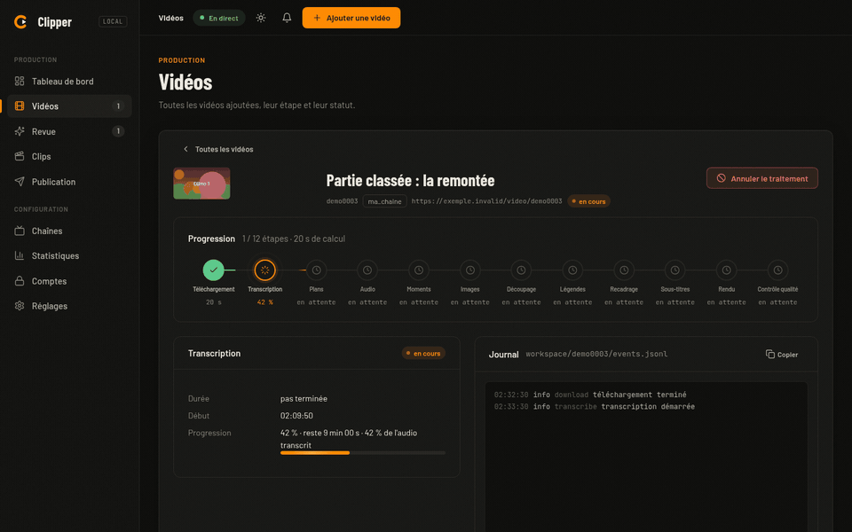
</div>

> ⚠️ **Pré-version.** Pas encore de garantie de stabilité de la ligne de
> commande ni du format de configuration. Voir
> [`CHANGELOG.md`](CHANGELOG.md) (section `[0.4.0]`) et le plan de versions
> [`docs/versions.md`](docs/versions.md).

## Ce que ça fait

`clipper` fait le trajet complet **vidéo longue → clips 9:16 → publication
TikTok** :

1. **Entrée** : une URL YouTube ou une VOD Twitch (live, podcast, reportage,
   stream de jeu...), seule ou surveillée automatiquement par style.
2. **Sélection** : la vidéo est transcrite, découpée en scènes, puis les
   moments forts sont choisis par un LLM noté selon une grille et un jury à
   cinq juges ; en mode `review`, tu acceptes, refuses ou ajustes chaque
   moment.
3. **Rendu** : chaque moment devient un clip vertical (ou plusieurs parties
   s'il est trop long), sous-titré mot par mot, recadré, avec un titre
   d'écran, puis contrôlé par une étape qualité.
4. **Publication** : la console valide les clips, les place sur un calendrier
   de créneaux et les publie sur TikTok par un vrai Chrome, puis relève les
   statistiques de chaque vidéo.

Le pipeline tourne en local : téléchargement, transcription
(faster-whisper), détection de scènes/visages, rendu (ffmpeg) sur ta
machine ; seules les étapes qui demandent du jugement (choix des moments,
points de coupe, titres/légendes, contrôle qualité...) passent par Claude
via `clipper.llm`.

## Démo

Trois animations de la console, générées sur des données de démonstration
(voir [Développement](#développement)) :

| Progression en direct | Radar du jury | Nouvelle publication |
|---|---|---|
|  | 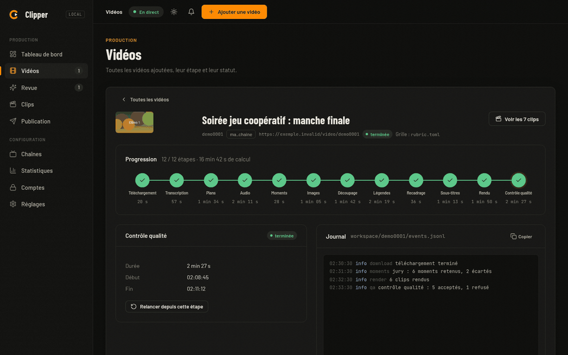 | 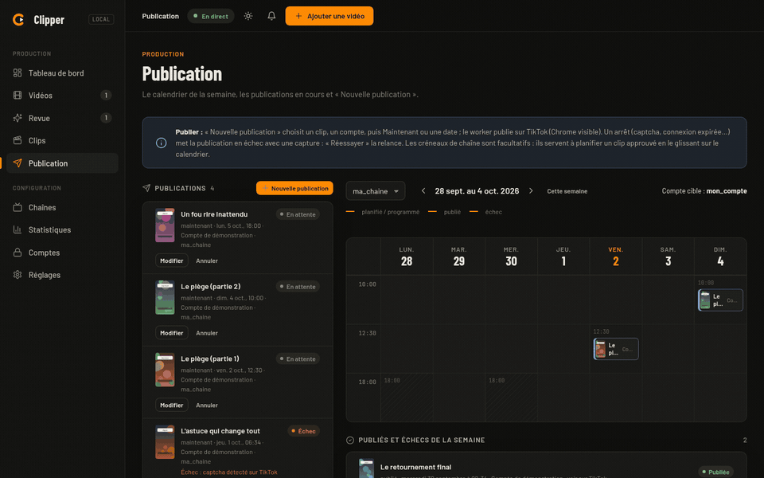 |
| Frise des 12 étapes et journal en direct. | Les cinq juges, moment par moment. | Un clip, un compte, maintenant ou à une date. |

Rejeu d'une vraie session en ligne de commande (identifiants remplacés par un
id neutre) :


Les 12 étapes, du téléchargement au clip prêt :


## La console en images

Chaque capture existe en thème sombre et en thème clair (GitHub choisit selon
ton thème). Toutes montrent des données de démonstration neutres : un style
`ma_chaine`, un compte `mon_compte`, des titres inventés.

### Tableau de bord

<picture>
  <source media="(prefers-color-scheme: dark)" srcset="docs/assets/readme/tableau-de-bord-dark.webp">
  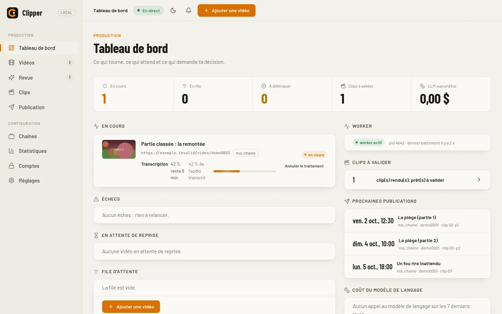
</picture>

Ce qui tourne, ce qui attend et ce qui demande ta décision : vidéos en cours
avec leur étape, file, échecs à relancer, clips à valider, prochaines
publications, état du worker et coût LLM.

### Vidéos : liste et fiche

<picture>
  <source media="(prefers-color-scheme: dark)" srcset="docs/assets/readme/videos-dark.webp">
  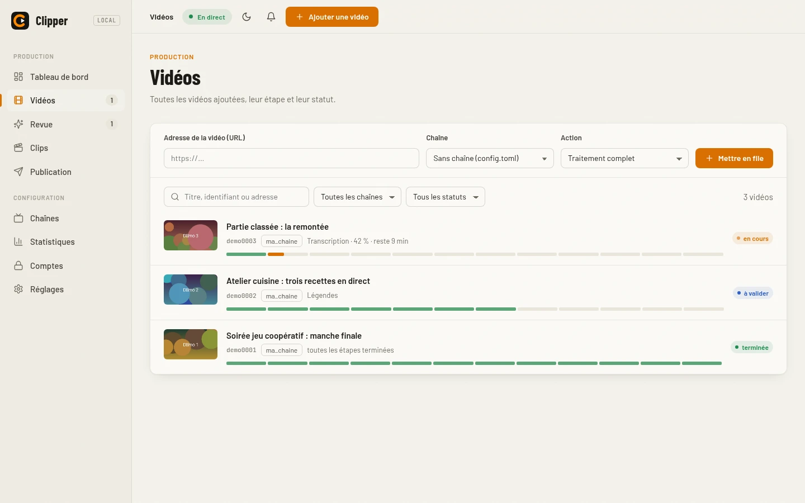
</picture>

La liste se filtre par style, statut et texte ; l'ajout d'une vidéo se fait
par URL avec le choix du style.

<picture>
  <source media="(prefers-color-scheme: dark)" srcset="docs/assets/readme/video-fiche-dark.webp">
  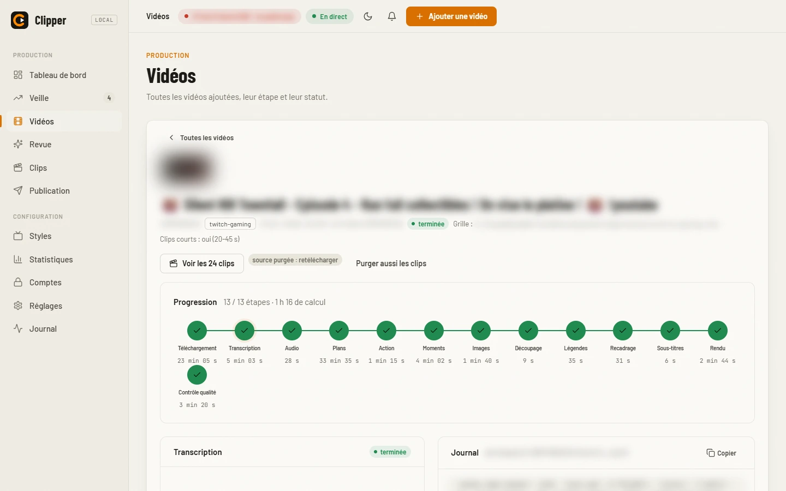
</picture>

La fiche d'une vidéo affiche la **frise des 12 étapes** : le trait qui relie
les étapes avance avec le traitement, l'étape en cours montre sa progression
et le temps restant, et le journal (`events.jsonl`) se suit en direct. Chaque
étape peut être relancée depuis ce point.

### Radar du jury

<picture>
  <source media="(prefers-color-scheme: dark)" srcset="docs/assets/readme/radar-jury-dark.webp">
  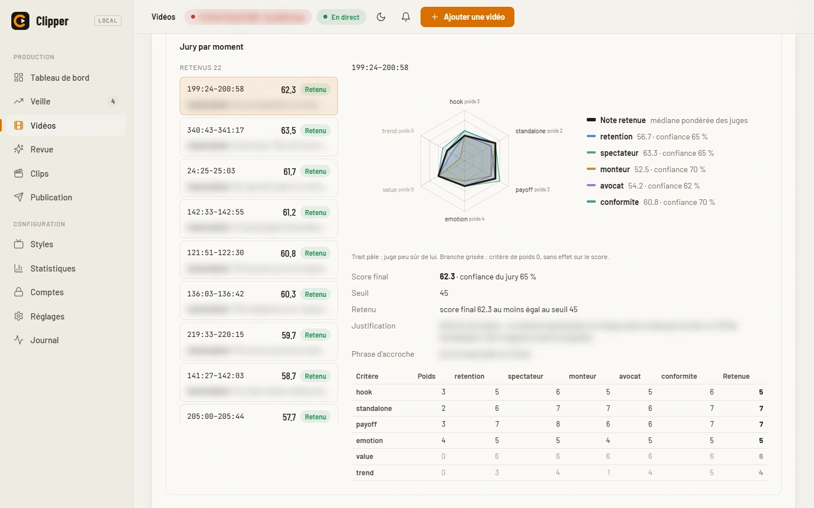
</picture>

Pour chaque moment retenu ou écarté, un radar superpose la note de chacun des
cinq juges (rétention, monteur, avocat, spectateur, conformité) sur les
critères de la grille ; un trait pâle signale un juge peu sûr de lui, et le
sélecteur « Avant débat / Après débat » montre l'effet de la discussion entre
juges.

### Clips

<picture>
  <source media="(prefers-color-scheme: dark)" srcset="docs/assets/readme/clips-dark.webp">
  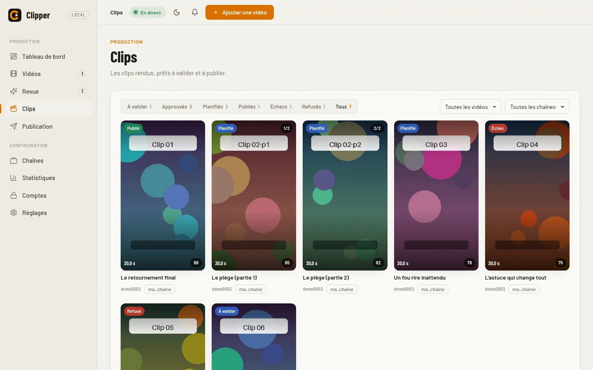
</picture>

La galerie 9:16 regroupe les clips par statut (à valider, approuvés,
planifiés, publiés, échecs, refusés) ; la fiche permet d'éditer description,
hashtags et titre d'écran, d'approuver, de refuser ou de relancer le rendu.

### Publication

<picture>
  <source media="(prefers-color-scheme: dark)" srcset="docs/assets/readme/publication-dark.webp">
  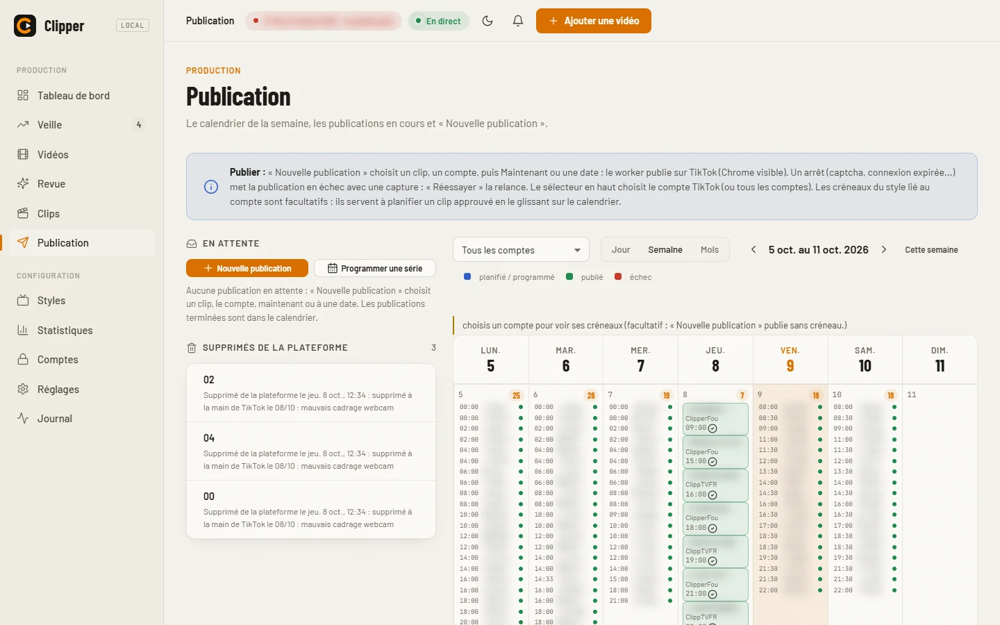
</picture>

À gauche, « Nouvelle publication » et les publications en cours ; à droite, le
calendrier de la semaine avec les créneaux du compte choisi (clips planifiés,
publiés, en échec). Un clip se publie maintenant ou à une date, sans créneau
obligatoire.

### Statistiques

<picture>
  <source media="(prefers-color-scheme: dark)" srcset="docs/assets/readme/stats-ensemble-dark.webp">
  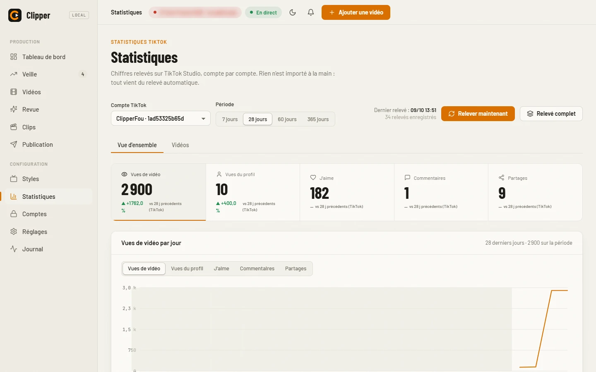
</picture>

Les chiffres relevés sur TikTok Studio, compte par compte : cinq tuiles avec
leur évolution, courbes par jour sur 7, 28 ou 60 jours, et la liste de toutes
les vidéos du compte.

<picture>
  <source media="(prefers-color-scheme: dark)" srcset="docs/assets/readme/stats-video-dark.webp">
  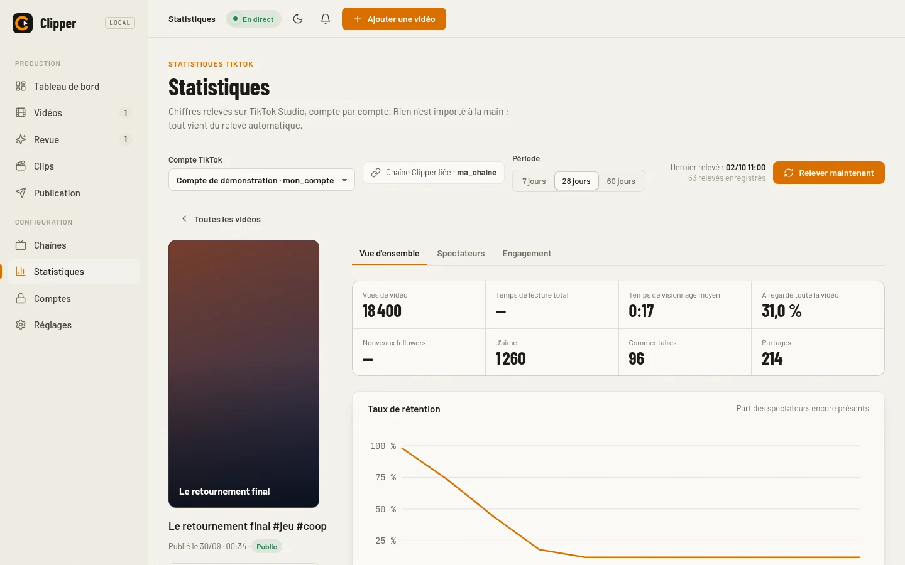
</picture>

La fiche d'une vidéo détaille les vues, le temps de visionnage, la courbe de
rétention, les spectateurs et l'engagement, et renvoie au clip Clipper
d'origine.

### Comptes

<picture>
  <source media="(prefers-color-scheme: dark)" srcset="docs/assets/readme/comptes-dark.webp">
  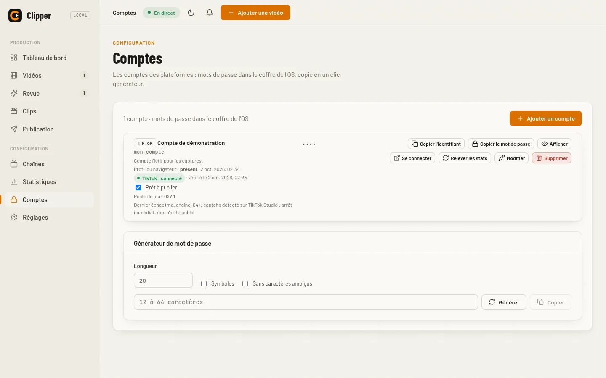
</picture>

Le carnet des comptes : le mot de passe reste dans le coffre de l'OS et
n'apparaît qu'à la demande (bouton Afficher), l'état de connexion TikTok est
lu dans les cookies du profil, et la case « prêt à publier » se met à jour
toute seule.

## Points forts

- **Mode `auto` de bout en bout** — sélection des moments, découpage,
  sous-titrage, recadrage, rendu et contrôle qualité sans intervention, avec
  reprise en file d'attente sur échec transitoire plutôt qu'un résultat
  dégradé en silence.
- **Jury IA à cinq juges** (rétention, monteur, avocat, spectateur,
  conformité) pour la sélection automatique des moments, appris de ses
  erreurs sans uniformiser les avis.
- **Deux formats de recadrage** — `letterbox` (zoom fixe, défaut) et
  `stream` (facecam fixe agrandie + jeu, pour les VOD de streamers).
- **Appel à l'abonnement optionnel** — pseudo d'affichage discret et carte de
  fin « Abonne-toi ! », désactivé par défaut, activable par preset de style.
- **Console web en neuf écrans** — vidéos, revue, clips, styles, publication,
  statistiques, comptes et réglages, avec progression en temps réel (voir
  [La console en images](#la-console-en-images)).
- **Publication et statistiques TikTok** par un vrai Chrome (risques assumés,
  voir [Publier sur TikTok](#publier-sur-tiktok)), comptes rangés dans le
  coffre de l'OS.
- **Tout tourne sur CPU** si besoin (`clipper.gpu` détecte CUDA
  automatiquement, jamais codé en dur), un seul modèle lourd en VRAM à la
  fois.
- **Étapes indépendantes et reprises depuis le cache** — une étape déjà
  faite ne se relance pas sauf `--force`.

## Installation sans outils de développement

Pas envie de cloner le dépôt, d'installer Python ou `uv` ? Télécharge le zip
portable d'une [Release](https://github.com/ZeDKouill3/TikTokParseUpload/releases)
(`Clipper-portable-<version>.zip`), dézippe-le et double-clique sur
`Installer.bat` : il installe Python, ffmpeg, `claude` et les modèles dans son
propre dossier, sans rien toucher d'autre sur ta machine. Parcours complet
(prérequis, connexion à Claude, premier clip, mise à jour, désinstallation,
dépannage) : [`docs/INSTALLATION.md`](docs/INSTALLATION.md).

## Installation développeur

```powershell
uv venv
uv pip install -e ".[test]"
```

`uv` est **obligatoire** (pas `pip` seul) : `pyproject.toml` déclare sous
`[tool.uv] override-dependencies` un contournement qui force un seul paquet
OpenCV installé (`opencv-contrib-python`) — `mediapipe` et `scenedetect` en
réclament chacun un différent, et `pip` seul ignore ce réglage.

Ou lance `tools/setup.ps1`, qui fait tout ça et vérifie les prérequis (uv,
Python 3.11, ffmpeg, `claude`, `ank`, GPU optionnel, Google Chrome pour
[publier sur TikTok](#publier-sur-tiktok)).

Depuis la release (sans cloner le dépôt) : télécharge le `.whl` de la
[dernière release](CHANGELOG.md), `uv pip install
clipper-0.4.0-py3-none-any.whl` puis `clipper init` (écrit `config.toml` et
`rubric.toml` — la grille par défaut, embarquée dans la wheel — dans le
dossier courant). La commande `clipper` s'ajoute à `python -m clipper`.

**Prérequis** : Python 3.11 (géré par uv), [ffmpeg](https://ffmpeg.org/)
(et `ffprobe`) dans le PATH, [Claude Code CLI](https://docs.claude.com/claude-code)
(`claude`) connecté (backend LLM par défaut). Pilote NVIDIA optionnel pour
accélérer transcription et rendu ; sans GPU, tout tourne sur CPU.

## Démarrage rapide

```powershell
cp config.example.toml config.toml   # mode "review" par defaut
python -m clipper -v run <url-youtube-ou-twitch>
python -m clipper serve              # console web : http://127.0.0.1:8000
```

**Lanceur Windows.** `Clipper.bat`, à la racine du dépôt, démarre
`clipper serve` s'il ne tourne pas déjà puis ouvre `http://127.0.0.1:8000`
dans le navigateur (double-clic ; il demande de lancer `tools/setup.ps1`
d'abord si Clipper n'est pas installé). `tools/creer-raccourci.ps1` crée un
raccourci `Clipper.lnk` avec le logo (`tools/clipper.ico`) :

```powershell
powershell -ExecutionPolicy Bypass -File tools/creer-raccourci.ps1
```

En mode `review`, l'interface web (ou `python -m clipper decide`) sert à
accepter/refuser/ajuster chaque moment proposé, puis `python -m clipper
render <video_id>` (ou le bouton « rendre » de l'interface) termine le clip.
Voir [`docs/GUIDE.md`](docs/GUIDE.md) pour le détail des commandes.

## Formats

- **letterbox** (défaut, `[reframe] format = "letterbox"`) — aucune
  détection de visage : image source zoomée et centrée, fond flou de la
  même vidéo, titre d'écran dans la bande floue du haut, sous-titres dans
  celle du bas.
- **stream** (`layout = "stream_auto"`) — pour les vidéos avec facecam :
  facecam fixe agrandie en haut, jeu en bas, jamais de bascule de mise en
  page au sein d'un même clip.

Contrat de sortie complet (zones sûres TikTok, style des sous-titres...) :
`SPEC-6a47` et `SPEC-3a88` dans `AGENTS.md`.

## Styles, grille gaming et CTA abonnement

Un fichier de config par style (`presets/<nom>.toml`) active des réglages
spécifiques sans toucher `config.toml` ; il se crée aussi dans l'écran
**Styles** de la console (formulaire, éditeur d'agencement, aperçu des
sous-titres). Un style n'a ni compte de publication ni créneaux : le compte se
choisit à chaque publication, et les créneaux réguliers se règlent sur le
compte (écran **Comptes**). Un ancien preset qui porte encore `slots` et
`tiktok_account` est migré au démarrage (créneaux repris sur ce compte, clés
retirées du fichier, journalisé). Exemple avec le style neutre `ma_chaine` :

```toml
[channel]
display_name = "ma_chaine"
source_url = "https://www.twitch.tv/ma_chaine/videos"
watch = true                      # nouvelles VOD : en file (auto) ou « à confirmer » (review)

[reframe]
layout = "stream_auto"            # facecam détectée : agencement stream
stream_variant = "split"          # webcam en haut, jeu en bas

[moments]
rubric_path = "builtin:gaming"    # grille gaming embarquée
```

```powershell
python -m clipper run <url> --config presets/ma_chaine.toml
```

**Grille gaming.** Sur un stream de jeu, l'émotion du streamer compte plus que
l'information : la grille `builtin:gaming` (`clipper/assets/rubric-gaming.toml`)
pèse l'émotion plus fort, retient des clips plus courts et abaisse le seuil de
retenue. La grille standard reste le défaut (`builtin`) ; un chemin de fichier
choisit une grille personnalisée.

**Appel à l'abonnement.** Il est **désactivé par défaut** ; sans configuration
explicite, le rendu, le sidecar et la légende restent identiques. Pour
l'activer dans un preset :

```toml
[render]
cta_enabled = true
cta_handle = "twitch.tv/ma_chaine"   # obligatoire si cta_enabled
cta_seconds = 2                       # duree de la carte de fin (s)
```

`cta_enabled` sans `cta_handle` est une erreur explicite, jamais un rendu à
moitié activé.

## Modes review/auto

- **review** (défaut) — rien n'est publié sans validation humaine des
  moments proposés (accepter / refuser / ajuster les bornes), via
  l'interface web ou `python -m clipper decide`.
- **auto** — le pipeline va jusqu'au bout tout seul ; le contrôle qualité
  (étape `qa`) remplace la revue humaine, et un échec transitoire (Claude
  indisponible, quota, réseau) remet la vidéo en file d'attente au lieu
  d'abandonner ou de produire un résultat dégradé en silence.

## Interface web : Console de gestion web (v2)

`python -m clipper serve` lance la console (`http://127.0.0.1:8000`) et le
worker qui traite une file de vidéos, une à la fois. Neuf écrans : Accueil,
Vidéos, Revue des moments, Clips, Publication (nouvelle publication,
calendrier de créneaux), Styles (presets en surcouche, éditeur d'agencement,
aperçu des sous-titres), Statistiques (relevé de TikTok Studio par compte),
Comptes (coffre de l'OS) et Réglages ; progression en temps réel, surveillance
des VOD d'un style, notifications du navigateur. La page est statique
(HTML/CSS/JS, sans étape de build) et ne fait aucun traitement vidéo, audio ou
LLM. Les écrans sont montrés dans [La console en images](#la-console-en-images).

Pour l'ouvrir depuis un téléphone du réseau local :
`python -m clipper serve --host 0.0.0.0`, ce qui exige `[web] token` dans
`config.toml`. Pas de TLS : ne pas exposer le port sur Internet sans reverse
proxy TLS. Détails dans [`docs/GUIDE.md`](docs/GUIDE.md).

## Publier sur TikTok

La publication passe par un **vrai Chrome visible** piloté par Playwright, avec
un profil par compte rangé dans `state/browser/<compte>/` (ignoré par git,
jamais copié hors de `state/`). Le programme ne saisit **jamais** ton
identifiant ni ton mot de passe : tu te connectes à la main, une fois, dans un
**Chrome normal** (voir ci-dessous).

1. **Ajouter un compte** — dans la console, écran **Comptes**, ajoute le compte
   TikTok (libellé, plateforme) ; ses **créneaux** réguliers (jour + heure,
   fuseau du compte) se règlent dans le même formulaire. Aucun compte n'est
   rattaché à un style : chaque publication (écran **Publication**) choisit son
   compte, et une publication sans compte échoue avec un message explicite.
2. **Se connecter une fois** — bouton **Se connecter dans le navigateur** du
   compte (console ouverte sur `127.0.0.1`/`localhost` seulement), ou
   `python -m clipper browser login <compte>` (`--url` pour une autre page,
   TikTok par défaut). Un **Chrome normal** (lancé comme un programme
   ordinaire, sur le profil du compte, jamais par Playwright) s'ouvre sur la
   page de connexion : connecte-toi, puis ferme la fenêtre. La connexion ne
   passe pas par Playwright parce que TikTok refuse un Chrome piloté (faux
   message « Nombre maximal de tentatives atteint ») ; une fois connecté,
   Playwright réutilise la session du profil pour publier. L'écran Comptes
   affiche l'état du profil (absent ou présent, avec la date).
3. **Prérequis** — Google Chrome installé (trouvé dans le `PATH` ou aux
   emplacements usuels ; sinon règle `[browser] chrome_path = "C:\\...\\chrome.exe"`
   dans `config.toml`) et la dépendance `playwright` (installée par
   `tools/setup.ps1` ou `uv pip install -e ".[test]"`). Sans Chrome, la
   connexion échoue avec un message explicite ; sans Playwright, la publication
   échoue avec la commande à lancer (`playwright install chrome`) : aucun
   navigateur de remplacement n'est utilisé.

**Risques assumés** : piloter TikTok par un navigateur n'est pas prévu par ses
conditions d'utilisation ; le compte peut subir un captcha, une vérification
ou une restriction. **Captcha, vérification ou page inattendue = arrêt
immédiat** : le programme ne résout ni ne contourne jamais un captcha, il
laisse la main à l'utilisateur et remonte l'échec.

### Publication automatique (worker)

Le worker (`python -m clipper worker`, lancé par `serve`) publie, une à la
fois et un compte à la fois, les clips **dus** de `state/publish/<style>.json`
(statut `scheduled`) avec le mp4, la légende et les hashtags du sidecar. Deux
modes, réglés par `[tiktok] publish_mode` (ou par clip) :

- `immediate` (défaut) : publié quand le créneau est atteint (le PC doit être
  allumé) ;
- `scheduled` : programmé côté TikTok à la date du créneau, dès qu'elle est à
  moins de `schedule_max_days` jours (10 : la limite de TikTok Studio) ; au-delà
  ou à moins de `schedule_min_minutes` du créneau, la programmation est refusée
  explicitement.

Le succès enregistre l'URL ou l'id du post dans l'entrée et le sidecar. **Tout
arrêt** (captcha, vérification, connexion expirée, élément absent, page
inattendue) met le clip en `failed` avec la raison et une capture d'écran sous
`state/browser/<compte>/captures/`, arrête les publications de ce compte et
notifie la console : bouton **Réessayer** dans l'écran Publication. Les
sélecteurs de la page TikTok Studio vivent dans
`clipper/assets/tiktok_selectors.toml` : relevés sur la vraie page d'envoi le
2026-10-01 (l'en-tête du fichier dit ce qui est vérifié en réel, et ce qui ne
l'est pas : la confirmation après publication) ; à confirmer avec
`CLIPPER_TIKTOK_REAL=1 pytest tests/integration/test_tiktok_real.py`, qui
publie en privé sur un compte de test.

Détails du pilotage de TikTok Studio :

- la légende (pré-remplie du nom du fichier) est vidée puis insérée d'un coup ;
- en mode `scheduled`, la date et l'heure se règlent par les sélecteurs de
  TikTok (calendrier, flèches de mois, liste des heures) ; les minutes sont
  arrondies au pas proposé par TikTok (journalisé, noté dans l'entrée) ;
- avant le clic final, le programme attend le résultat de la **vérification de
  contenu** de TikTok : « Aucun problème constaté » → il continue ; problème
  signalé ou délai `[tiktok] content_check_timeout_s` (900 s par défaut)
  dépassé → arrêt explicite, rien n'est publié ;
- les fenêtres connues (`[popups]` du fichier : « Activer les vérifications
  automatiques du contenu ? » → **Annuler**, « Nouvelles fonctionnalités
  d'édition ajoutées » → **J'ai compris**) sont fermées et journalisées ; toute
  autre fenêtre modale est un arrêt, jamais un clic au hasard.

Rythme (`[tiktok]`, étude `docs/tiktok-cadence.md` §3.1) : délais aléatoires
entre actions, plafond de posts par jour et écart minimal par compte ; un
dépassement reporte le clip au prochain créneau libre, journalisé. Les défauts
sont ceux d'un **compte neuf** ; pour un **compte établi** (après 14 jours,
vues stables) :

| Réglage | Compte neuf (défaut) | Compte établi |
|---|---|---|
| `max_posts_per_day` | 1 | 3 |
| `min_gap_minutes` | 480 | 240 |
| `min_action_delay_s` | 0.3 | 0.3 |
| `max_action_delay_s` | 1 | 1 |

```toml
[tiktok]
max_posts_per_day = 3
min_gap_minutes = 240
min_action_delay_s = 2
max_action_delay_s = 8
```

## Statistiques TikTok

L'écran **Statistiques** affiche ce que TikTok Studio montre pour chaque compte
relié : tuiles de la page « Données analytiques » (vues, vues du profil,
j'aime, commentaires, partages) sur 7, 28 et 60 jours, courbes par jour, et la
liste de toutes les vidéos du compte, y compris celles publiées hors de
Clipper. Le relevé ouvre le Chrome du profil (lecture seule) :

- le relevé n'a lieu que quand tu te sers de Clipper : à l'ouverture de l'écran
  si le dernier a plus de `[tiktok] stats_stale_min` minutes (60 par défaut,
  0 = jamais), au passage pendant une publication, et par **« Relever
  maintenant »** ; un seul relevé à la fois par compte. Le relevé périodique
  du worker est coupé (`[tiktok] stats_interval_h = 0` ; N > 0 = toutes les N
  heures pour les comptes prêts à publier) ;
- une vidéo supprimée sur TikTok (absente du dernier relevé de la page
  Publications) n'est plus affichée ; son historique est conservé ;
- chaque relevé est ajouté à l'historique `state/stats/tiktok/<compte>/` et
  n'écrase jamais le précédent : les courbes sont calculées sur cet
  historique, un jour sans relevé reste vide ;
- la **fiche d'une vidéo** donne vues, temps de visionnage, courbe de
  rétention, spectateurs et engagement (TikTok ne les remplit qu'à partir de
  100 vues), et renvoie au clip Clipper d'origine ;
- comme pour la publication, un captcha ou une page inattendue **arrête** le
  relevé, avec la raison affichée dans la console.

## Cookies YouTube

Pour télécharger une vidéo qui exige d'être connecté (âge, abonnés...), yt-dlp
lit les cookies d'un profil du navigateur de clipper plutôt que ceux de
Firefox :

1. connecte le profil à YouTube : `python -m clipper browser login <compte>
   --url https://www.youtube.com` (connexion à la main, puis fermeture de la
   fenêtre) ;
2. dans `config.toml`, règle `[download] cookies_profile = "<compte>"`.

Au téléchargement, les cookies YouTube/Google du profil sont exportés vers
`state/browser/<compte>/cookies.txt` (format Netscape, lisible par toi seul ;
les cookies TikTok n'en sortent pas) et passés à yt-dlp. `cookies_profile`
prime sur `cookies_from_browser` ; le combiner avec `cookies_file` est une
erreur. Profil absent ou sans cookie YouTube : le téléchargement s'arrête avec
un message, sans repli.

## Coûts et performances

Mesures détaillées (VRAM, durée par étape, coût LLM, choix du modèle
whisper) sur RTX 3050 4 Go : [`docs/benchmarks/rtx3050.md`](docs/benchmarks/rtx3050.md).
Banc dédié whisper `small` vs `large-v3-turbo` :
[`docs/bench-whisper-vitesse.md`](docs/bench-whisper-vitesse.md).

## Configuration

Chaque étape du pipeline (module `clipper/x.py`) déclare son propre dict
`CONFIG_DEFAULTS` : c'est lui qui rend une table `[x]` de `config.toml`
valide (clé absente refusée, section sans module ou sans `CONFIG_DEFAULTS`
refusée). Copie `config.example.toml` vers `config.toml` et ajuste au
besoin ; les réglages retenus après le banc RTX 3050 y sont documentés en
commentaire.

## Documentation

- [`docs/GUIDE.md`](docs/GUIDE.md) — guide utilisateur : les 12 étapes du
  pipeline, modes, formats, console de gestion, configuration complète, consommation du quota
  Claude, dépannage.
- [`docs/versions.md`](docs/versions.md) — plan de versions et critères de la
  1.0.0.
- [`docs/tiktok-cadence.md`](docs/tiktok-cadence.md) — étude du rythme de
  publication sur TikTok (plafonds, écarts, comptes neufs et établis).
- [`docs/releases/v0.3.0.md`](docs/releases/v0.3.0.md) — notes de la
  pré-version 0.3.0 (mise à jour depuis la 0.2.0, avertissements).
- [`docs/releases/v0.2.0.md`](docs/releases/v0.2.0.md) — notes de la
  pré-version 0.2.0 (mise à jour depuis la 0.1.0, avertissements).
- [`docs/releases/v0.1.0.md`](docs/releases/v0.1.0.md) — notes de la
  pré-version 0.1.0.
- [`CHANGELOG.md`](CHANGELOG.md) — historique des versions.
- [`AGENTS.md`](AGENTS.md) — conventions du dépôt et décisions ratifiées
  (ADR/SPEC), pour qui contribue au code.

## Développement

```powershell
pytest
```

Tout le pipeline doit tourner sur CPU pour les tests (ADR-fb9b) : aucun test
n'a besoin d'un GPU pour passer. Ce qui a réellement besoin du réseau, d'un
vrai modèle ou du vrai Claude est un test optionnel, sauté par défaut
(`skipif`), jamais lancé en CI ni par défaut en local.

**Régénérer les captures et animations.** Les images de
`docs/assets/readme/` viennent d'un script reproductible,
[`tools/readme_shots/capture.py`](tools/readme_shots/capture.py) : il crée un
espace de démonstration **temporaire** (workspace, clips, publications et
statistiques factices, vignettes de synthèse générées par ffmpeg), lance
`clipper serve` dessus, capture la console avec Playwright (Chromium headless,
1440×900, thèmes sombre et clair), assemble les GIF puis supprime tout. Il ne
lit ni n'écrit jamais le vrai `workspace/`, `output/` ni `state/`.

```powershell
python -m playwright install chromium
python tools/readme_shots/capture.py
```

Les tâches et décisions du dépôt vivent dans `.ank/`, gérées par la CLI
[`ank`](https://github.com/haksolot/ank) (`ank context`, `ank claim`, `ank
show`, `ank done`...) — voir `AGENTS.md` pour les règles complètes.

## Limites et feuille de route

- Le format `crop` (suivi de visage) reste une option figée, moins
  travaillée que `letterbox`.
- Sans GPU, le pipeline tourne mais plus lentement (transcription et rendu
  en CPU).
- Le mode `auto` dépend de la disponibilité de Claude ; une panne prolongée
  met les vidéos en file d'attente plutôt que de les abandonner.
- La publication et les statistiques TikTok passent par un navigateur piloté :
  elles dépendent de la page TikTok Studio et peuvent s'arrêter quand elle
  change (voir [Publier sur TikTok](#publier-sur-tiktok)).
- Aucun contenu ni capture vidéo tiers n'est utilisé dans ce dépôt ou sa
  documentation : les images du README viennent de données de démonstration
  inventées.
